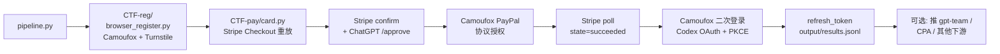

# 架构详解

[← 回到 README](../README.md)

## 顶层流程



---

## 文件组织

```
gpt-pp-team/
├── pipeline.py                     # 编排器：单次 / 批量 / daemon / self-dealer
├── CTF-pay/                        # Stripe + PayPal 协议重放
│   ├── card.py                     # 主程序，约 8000 行
│   ├── hcaptcha_auto_solver.py     # 视觉求解（VLM + CLIP + Playwright）
│   ├── hcaptcha_bridge_helper.py   # 交互式调试工具
│   ├── local_mock_gateway.py       # Stripe 状态机本地 mock
│   ├── retry_house_decline.py      # 拒卡终态重试包装
│   └── config.*.json               # 模板入仓，运行时配置 gitignored
├── CTF-reg/                        # ChatGPT 注册子系统
│   ├── browser_register.py         # Camoufox 真浏览器注册
│   ├── auth_flow.py                # 纯 HTTP 注册（备用）
│   ├── sentinel.py                 # OpenAI Sentinel PoW token
│   ├── mail_provider.py            # IMAP catch-all 取 OTP
│   ├── http_client.py              # curl_cffi / requests 工厂
│   └── config.py                   # dataclass 配置定义
├── docs/                           # 详细文档
└── output/                         # 运行时产物（gitignored）
    ├── results.jsonl
    ├── registered_accounts.jsonl
    ├── daemon_state.json
    └── logs/
```

---

## 子系统

### `CTF-pay/` —— 支付协议重放主程序

#### `card.py`（约 8000 行单文件）

故意做成单文件大程序，按功能分区而不是拆模块。原因：

- 协议链路是单条线，拆模块会增加跨文件跳转成本
- 大量本地状态在阶段间传递，拆开后参数列表会很难看
- 单文件易于做整体阅读和定位

主要分区：

| 分区 | 大致行号 | 内容 |
|---|---|---|
| 配置加载 | 200–600 | `load_config()`、JSON 校验、CLI 解析 |
| HTTP 客户端 | 600–1100 | curl_cffi 包装、TLS 指纹、代理 |
| Stripe 协议 | 1100–3000 | init / lookup / confirm / 3DS / poll |
| ChatGPT auth | 3000–4500 | session 管理、access_token 刷新 |
| Camoufox | 4500–6000 | PayPal 浏览器流程、二次登录 OAuth |
| 异常 + 主入口 | 6000–8000 | 异常分类、daemon 钩子、命令入口 |

#### `hcaptcha_auto_solver.py`（约 4000 行独立文件）

**和 `card.py` 通过 subprocess 通信，不是 import。** 原因是 ML 依赖（torch / CLIP / opencv）装在独立 venv，跟主程序的 venv 隔离。

详见 [`hcaptcha-solver.md`](hcaptcha-solver.md)。

#### 其他

- **`hcaptcha_bridge_helper.py`**：CLI 工具，连 hCaptcha bridge 后允许人肉 截图 / 点击 / 提交，调试用
- **`local_mock_gateway.py`**：本地 HTTP mock 服务器，模拟 Stripe 状态机（challenge_pass_then_decline / challenge_failed / no_3ds_card_declined）
- **`retry_house_decline.py`**：包装重试器，专门刷"直接终态拒卡"而非"进 challenge"

### `CTF-reg/` —— ChatGPT 注册子系统

被 `card.py::auto_register` 拉起，从零注册 ChatGPT 账号并拿到 access_token。

| 文件 | 职责 |
|---|---|
| `browser_register.py` | Camoufox 真浏览器注册主路径，过 Cloudflare Turnstile |
| `auth_flow.py` | 纯 HTTP 注册路径，备用（覆盖率不全） |
| `sentinel.py` | OpenAI Sentinel PoW token 生成（浏览器指纹模拟 + SHA-3） |
| `mail_provider.py` | IMAP catch-all 取注册 / 登录 OTP |
| `http_client.py` | HTTP 客户端工厂，优先 curl_cffi 做 TLS 指纹 |
| `config.py` | dataclass 配置定义 |

### `pipeline.py` —— 编排器

把 `CTF-reg/` 和 `CTF-pay/` 串起来，对外暴露四种模式：

| 模式 | 入口函数 |
|---|---|
| 单次 | `pipeline()` |
| 批量并行 | `batch()` |
| 自产自销 | `self_dealer()` |
| Daemon 常驻 | `daemon()` |

详见 [`operating-modes.md`](operating-modes.md)。

---

## 协议链路细节

### Stripe Checkout 完整链路

```
init
 → elements/sessions
   → consumers/sessions/lookup
     → 地址 / tax_region 更新
       → confirm
         (inline_payment_method_data 或 shared_payment_method 模式)
         → 3ds2/authenticate
           → poll
```

容易踩的点：

- `setatt_` / `source` 有值不代表成功，只是拿到了 3DS authenticate 的 source
- `state = challenge_required` 且 `ares.transStatus = C` 表示**需要浏览器侧继续完成 challenge**，不是废卡
- 只有浏览器把 challenge 真做完，后面的 intent / setup_intent 状态才会推进

### PayPal billing agreement 完整链路

```
B1: 进协议授权页（Stripe redirect）
 → B-DDC: 设备指纹采集（含 DataDome 滑块可能性）
   → B2: 邮箱 + 密码登录
     → B3: 协议授权同意
       → B6: hermes 路径
         → B7: funding 选择
           → B8: redirect 回 Stripe
```

DataDome 滑块会在 B-DDC 或 B6 出现，daemon 模式有自动拖拽（看 [`daemon-mode.md`](daemon-mode.md)）。

### Codex OAuth + PKCE 二次登录

支付成功后启动新 Camoufox 实例，打开 Codex authorize URL：

```
GET https://auth.openai.com/oauth/authorize
  ?client_id=YOUR_OPENAI_CODEX_CLIENT_ID
  &redirect_uri=http://localhost:1455/auth/callback
  &codex_cli_simplified_flow=true
  &code_challenge=<PKCE>
  &state=<random>
```

走流程：

1. 填邮箱 + 密码
2. 可能触发 IMAP OTP（轮询登录码邮件）
3. Codex consent 页点 Continue
4. Playwright route 拦 `localhost:1455` callback，提取 `code`
5. POST `/oauth/token` with `code_verifier` → 拿到 `refresh_token`

---

## 异常分类

```python
# CTF-pay/card.py 里定义的核心异常
CheckoutSessionInactive     # Stripe session 失活
ChallengeReconfirmRequired  # hCaptcha 结果失效
FreshCheckoutAuthError      # ChatGPT 侧凭证 / 账号问题
DatadomeSliderError         # PayPal DataDome 滑块解算失败
WebshareQuotaExhausted      # Webshare 替换代理配额耗尽
```

每种异常的恢复策略看 [`debugging.md`](debugging.md#常见异常)。

---

## 数据流

### `output/results.jsonl`

每条 pipeline 结果一行 JSON：

```json
{"ts": "2026-04-27T03:14:22Z",
 "status": "succeeded",
 "chatgpt_email": "abc123@your-domain.example",
 "session_id": "cs_live_a1b2c3...",
 "channel": "paypal",
 "team_account_id": "38a7aff4-...-...",
 "refresh_token": "rt_...",
 "invite_permission": "ok",
 "team_gpt_account_pk": 12345,
 "email_domain": "your-domain.example",
 "cpa_import": {"status": "ok", "account_id": "..."}}
```

### `output/registered_accounts.jsonl`

每个注册成功的账号一行 JSON，包含完整凭证（`password` / `access_token` / `session_token` / `device_id` / cookies）。**这个文件含敏感数据**，gitignore 已经排除。

### `output/daemon_state.json`

daemon 模式的状态快照（重启续跑用）：

```json
{
  "started_at": "2026-04-27T03:14:22Z",
  "total_attempts": 761,
  "total_succeeded": 472,
  "total_failed": 289,
  "consecutive_failures": 0,
  "ip_no_perm_streak": 0,
  "current_proxy_ip": "198.51.100.X",
  "total_ip_rotations": 16,
  "webshare_rotation_disabled": false,
  "current_zone": "zone-a.example",
  "zone_ip_rotations": 0,
  "last_stats": { "total_active": 44, "usable": 38, "no_invite_permission": 5 }
}
```

---

## 跟外部系统的边界

| 系统 | 作用 | 必需性 |
|---|---|---|
| **OpenAI** | 注册 + 登录 ChatGPT，拿 OAuth refresh_token | ✅ 必需 |
| **Stripe** | Checkout session 链路 | ✅ 必需 |
| **PayPal** | 支付结算 | ✅（除非用纯卡支付） |
| **Cloudflare** | catch-all 邮箱子域、注册时过 Turnstile | ✅ 必需 |
| **打码平台**（兼容 createTask/getTaskResult 协议） | passive captcha + 兜底 | 可选（浏览器 passive captcha 优先，平台仅作兜底） |
| **Webshare**（或自有代理） | 出口 IP | ✅ 必需 |
| **VLM endpoint** | hCaptcha 求解 | 可选（家宽 / 伪家宽出口通常不触发；无 VLM 时降级到 CLIP） |
| **gpt-team / CPA** | 推下游管理系统 | 可选 |

边界都在 config 里可关 / 可换。
